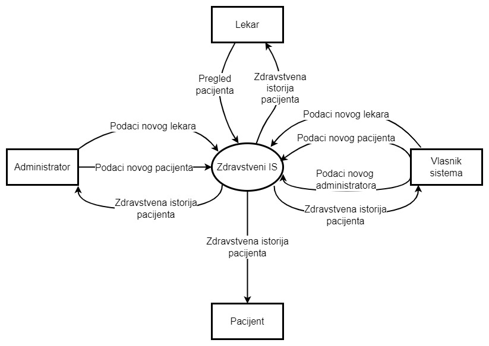
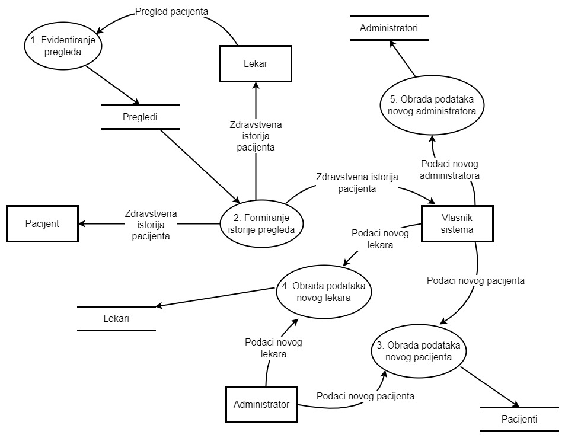
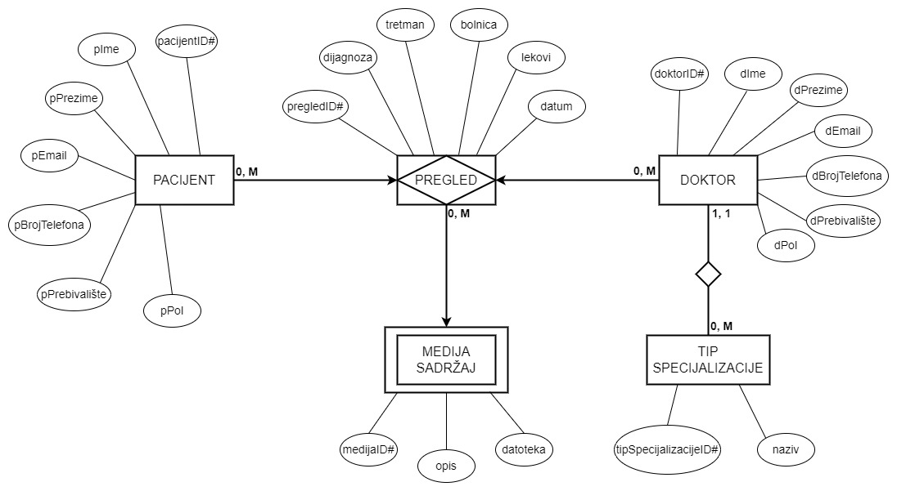
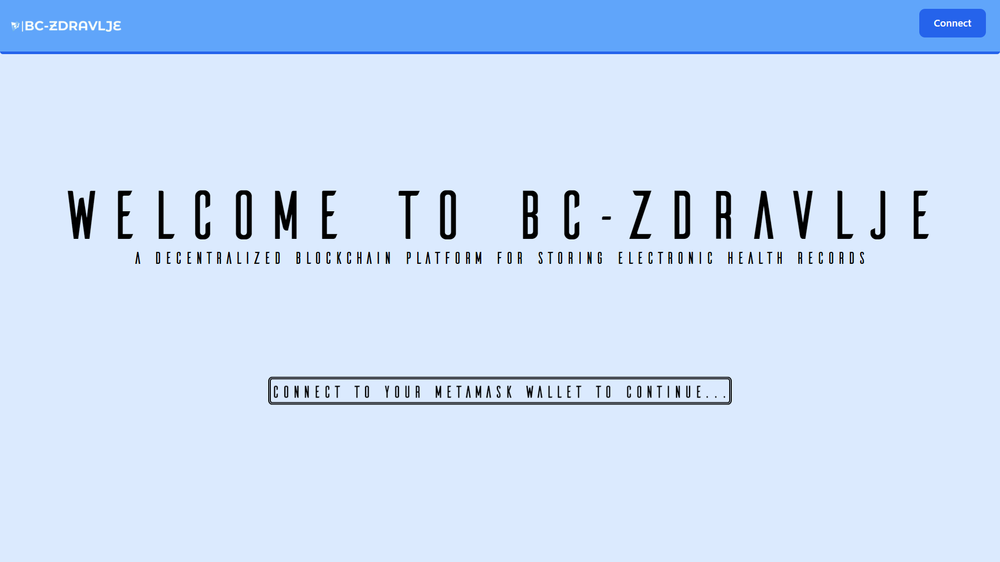
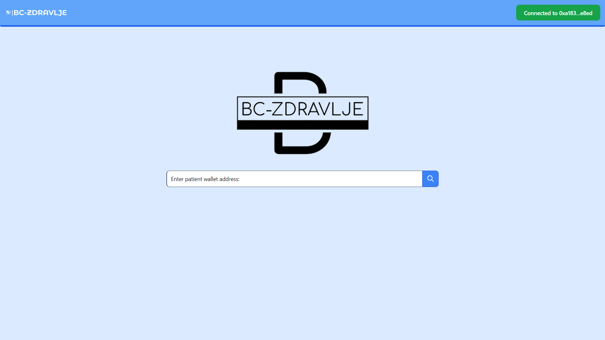
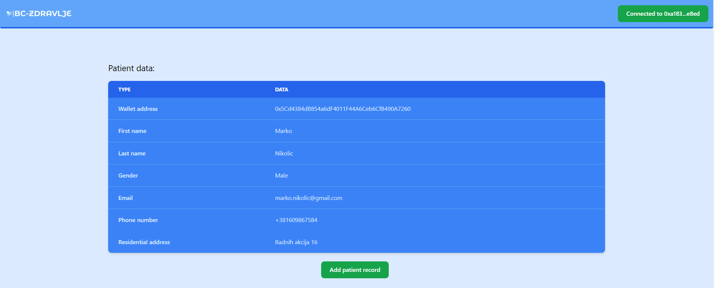
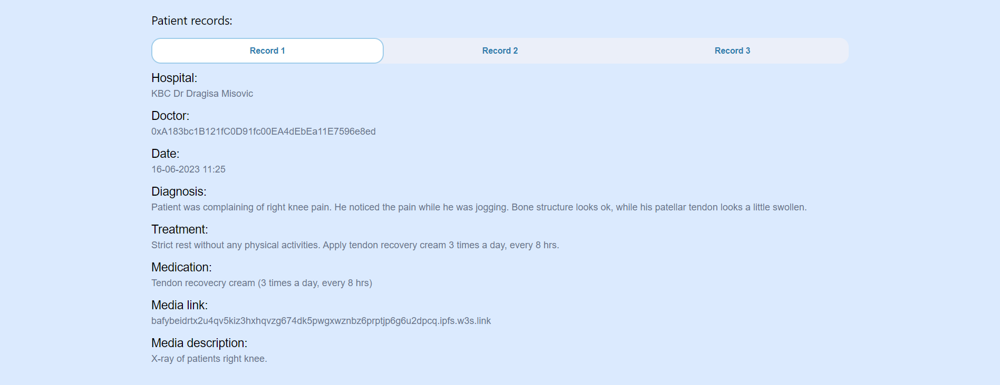
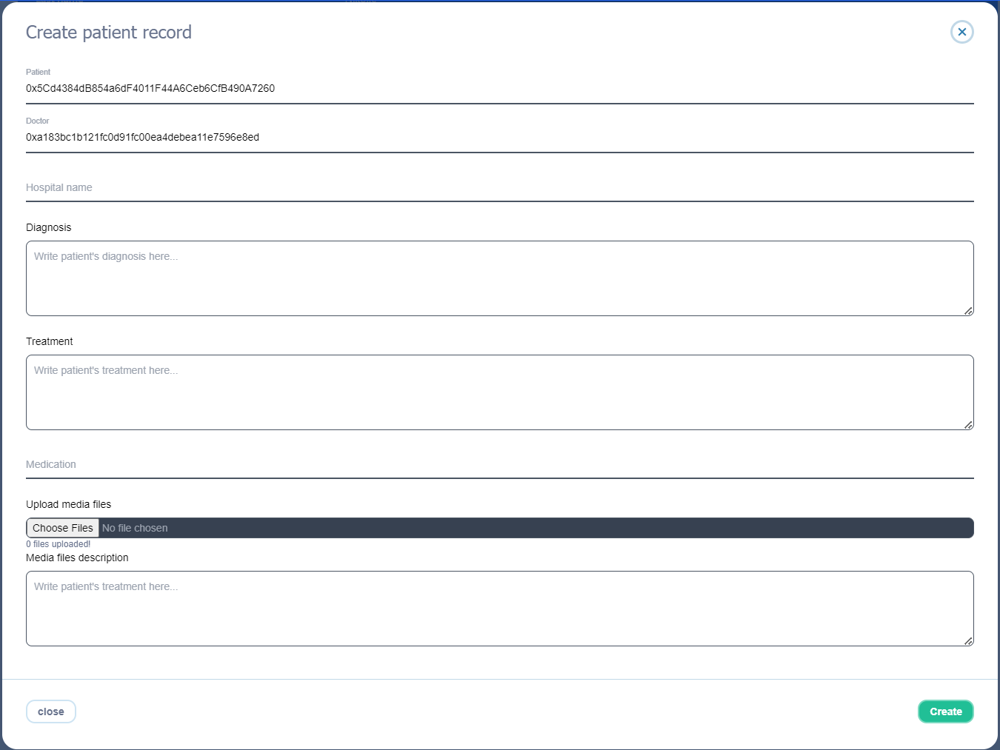

<h1 align="center">
Sistem za upravljanje zdravstvenim podacima pacijenata zasnovan na blockchain tehnologijama
</h1>

# Sadržaj

<details>
<summary>Prikaži sadržaj</summary>

1. [Uvod](#uvod)
2. [Problemi sistema u upotrebi](#problemi-sistema-u-upotrebi)
3. [Analiza problema](#analiza-problema)
   1. [Rečnik podataka](#rečnik-podataka)
   2. [Struktura sistema](#struktura-sistema)
4. [Dizajn](#dizajn)
5. [Implementacija](#implementacija)
6. [Zaključak](#zaključak)

</details>

# Uvod

Zdravstvena industrija nesumnjivo zahteva konstantno napredovanje i modernizaciju. Napori ka poboljšanju su skoro isključivo usmereni ka medicinskim naukama, metodama i tehnikama lečenja. Iako je to možda i najvažniji deo zdravstva, smatram da nije i jedini koji je važan. Jedan od takvih pomoćnih delova je i informacioni sistem, koji je kod nas prilično zapostavljen i nedovoljno performantan. Primarna funckija zdravstva neretko može biti ograničena pomoćnim sistemima, pogotovo kada su razlike u efikasnosti velike.

# Problemi sistema u upotrebi

Obzirom da trenutni zdravstveni informacioni sistem ne poseduje funkciju i infrastrukturu za **skladištenje medicinske istorije pacijenata** i da ne postoje nikakvi mehanizmi **integracije podataka**, o informacijama vezanim za prethodne _preglede_ najčešće se brine pacijent. Dodatni problem predstavlja što su ovi podaci isključivo fizički dokumenti, najčešće papirnog oblika. Ove činjenice dovode do znatnog povećanja rizika od nestanka ili oštećenja dokumenata što kao posledicu ima **nepotpune informacije** o pacijentovoj medicinskoj istoriji.

> Pregledi podrazumevaju: analize, izveštaje, recepte, dijagnoze, snimke, terapije, kontrole, ...

Opasnost ne predstavlja samo nedužno gubljenje podataka, već i mogućnost pacijenta da namerno manipuliše podacima, što podrazimeva **izostavljanje i prikrivanje informacija**, ili čak njihovu **izmenu i modifikovanje** onda kada pacijent smatra da mu to ide u prilog, čime se u pitanje dovodi **integritet podataka**.

# Analiza problema

Problemi skladištenja podataka koji u pitanje dovode njihovu sigurnost i integritet predstavljaju veliki problem kako za medicinske radnike tako i za pacijente. Značajnost medicinskih podataka je veoma velika i svaka nepravilnost može dovesti do velikih posledica. Uslovi za rad lekara su nepotrebno otežani time što ne postoji garancija podataka već su primorani da veruju u njihovu potpunost i tačnost iako nad njima nemaju nikakvu kontrolu.

Rešenje ovih problema podrazumeva prelazak na skladištenje podataka primarno u elektronskom obliku i prebacivanje odgovornosti na zdravstveni sistem, koji bi bio zadužen za čuvanje svih podataka. Ovakva struktura otvorila bi nove probleme kao što su hakerski napadi, krađa podataka, jedinstvena tačka otkaza i tako dalje, pa bi ovakav sistem zahtevao dodatne sigurnosne mere. Neophodno je dizajnirati sistem koji nesumljivo obezbeđuje potpunu validnost podataka, njihovu nepromenljivost i postojanost. Korišćenje distribuiranosti bi dodatno osiguralo podatke i povećalo efektivnost sistema. Pored zaštite od spoljašnjih uticaja na sistem, dizajniranje uloga u sistemu sa različitim nivoima pristupa podacima je jedan od važnijih koraka ka cilju sigurnosti podataka i odgovornosti učesnika sistema.

Da bi sistem bio potpun neophodno je pacijentima pružiti pristup njihovom podacima, ali bez mogućnosti izmene ili brisanja. Ovakav sistem bi, iako veoma kompleksan, morao da bude jednostavan za korišćenje kako ne bi predstavljao teret zdravstvenim radnicima i nepotrebno otežavao njihov primarni posao i kako bi privukao pacijente da ga zaista koriste.

## Rečnik podataka

<center>



<ins>**Slika 1.**</ins> SSA dijagram konteksta

</center>

**Slika 1** prikzuje da su glavni članovi sistema <ins>pacijent, lekar, administrator i vlasnik sistema</ins>. Za svakog od njih potrebno je definisati različite nivoe pristupa u skladu sa njihovim potrebama i ovlašćenjima. Pacijentima je neophodno pružiti informacije o pregledima, lekaru mogućnosti za njihovo kreiranje, dok su administratori i vlasnik zaduženi za upravljanje sistemom.

<center>



<ins>**Slika 2.**</ins> SSA prvi nivo dekompozicije

</center>

<ins>**Zdravstvenim radnicima**</ins> (pre svega lekarima) potrebno je omogućiti pristup sistemu i uvid u osnovne podatke pacijenta kao i njegovu kompletnu medicinsku istoriju, sa detaljnim uvidom i podacima o svakom pregledu. Nako obavljenih pregleda neophodno je lekaru pružiti mogućnost kreiranja novog zapisa i njegovog trajnog dodavanja u pacijentovu istoriju.

<ins>**Pacijenti**</ins> takođe imaju potrebu zu uvidom u medicinsku istoriju i detaljan pregled svakog zapisa, ali im je zbog poverljivosti i sigurnosti podataka neophodno omogućiti pregled samo sopstvene istorije bez prava na kreiranje novih zapisa.

Uloge <ins>**vlasnika sistema i administratora**</ins> se javljaju iz potrebe za održavanjem sistema i neophodnosti stalnog kreiranja novih pacijenata i registrovanja lekara. Njihova funkcija ne bi smela da im pruža mogućnosti kreiranja medicinskih podataka ili njihove manipulacije.

Na osnovu korisničkih zahteva i procesa sistema sa slike (_**Slika 2.** SSA prvi nivo dekompozicije_) možemo kreirati slučajeve korišćenja:

- Kreiranje administratora
- Kreiranje lekara
- Kreiranje pacijenata
- Kreiranje zapisa medicinskog pregleda
- Pregled osnovnih podataka pacijenata
- Uvid u prethodne preglede pacijenata (medicinska istorija)
- Prijava na sistem

## Struktura sistema

Struktura sistema mora biti konstruisana da podržava sve prethodno navedene slučajeve korišćenja. Pored toga, potrebno je misliti na potencijalne promene i proširenja sistema u budućnosti pa sistem mora biti projektovan na način koji takve promene i proširenja olakšava. Sistem može biti predstavljen skupom objekata i njihovih veza, gde je svaki objekat opisan preko svojih svojstava odnosno, atributa. Primer opšteg prikaza takvog sistema koji bi uz odgovarajuću implementaciju mogao da zadovolji zahteve prethodno opisanog sistema dat je na slici (_**Slika 3.** Prošireni model objekti-veze_).

<center>



**Slika 3.** Prošireni model objekti-veze

</center>

# Dizajn

Uzimajući u obzir sve zahteve sistema i probleme njegovog razvijanja, `blockchain` tehnologija predstavlja optimalno rešenje. Korišćenjem blockchain tehnologija neupitno se osigurava autentičnost podataka čime se rešavaju glavni zahtevi ovakvog zdravstvenog informacionog sistema. To se postiže potpunim nedostatkom mogućnosti izmene ili brisanja podataka, kao i nepovratnim kreiranjem novih zapisa. Postupak sigurne identifikacije kako pacijenata tako i lekara je moguće postići uz minimalne napore što dovodi do povećanja odgovornosti korisnika sistema i lakog definisanja modifikatora pristupa podacima.

Neke od `blockchain platformi` koje bi mogle da se koriste za razvoj ovakvog sistema su <ins>Ethereum, Solana, Avalanche, ...</ins> Dva najpoznatija API provajdera ka pristupnim čvorovima blockchain mreža su <ins>Infura i Alchemy</ins> koji suštinski nemaju velikih razlika i predstavljaju neophodne delove za funkcionisanje sistema i povezivanje na mrežu. Kako bi sistem bio potpun neophodno je omogućiti i interoperabilnost u korišćenju `blockchain wallet-a` za čuvanje valuta korisnika i koji bi imao funkciju jedinstvenog indetifikovanja svih korisnika i članova sistema. Wallet-i koje je moguće koristiti su: <ins>Metamask, Coinbase Wallet, WalletConnect, TrustWallet, ...</ins>

Kako je _medijski sadržaj_ nemoguće direktno skladištiti na blockchain mreži, postavlja se pitanje koji je najbolji način za skladištenje ovakvog sadržaja. Jedan od načina je tradicionalno čuvanje u bazi podataka gde bi se sav medijski sadržaj skladištio na pojedinačnom (ili malom broju) servera. Drugi način je korišćenje `IPFS (InterPlanetary File System) protokola`, kjoji predstavlja peer-to-peer mrežu za čuvanje i deljenje podataka u distribuiranom sistemu.

> U medijski sadržaj se ubrajaju: slike, snimci, dokumenti, skenirani podaci, ...

Za kreiranje korisničkog interfejsa web aplikacije postoji veliki izbor framework-ova koji se baziraju na korišćenju JavaScript-a, HTML-a i CSS-a. Neki od njih koji bi mogli da se iskoriste za razvoj ovakvog sistema su <ins>React, Next, Angular, Svelte, Vue, ...</ins>

# Implementacija

Moj izbor blockchain platforme je `Ethereum`. Ethereum mreža je jedna od najkorišćenijih za razvoj sistema baziranim na blockchain tehnologijama, ima veliku zajednicu programera. Zbog velikog broja podržavajućih sistema i usluga Ethereum ima zavidan nivo interoperabilnosti. Jedna od mana korišćenja Ethereuma (ili blockchain tehnologija generalno) može biti brzina perzistencije novih podataka odnosno obavljanja transakcija upisivanja. Obzirom da je za sistem zdravstva mnogo važnija sigurnost podataka i da se kreiranje zapisa o pregledima, koji predstavljaju najveći udeo transakcija upisivanja, dešava sekvencijalno i sa relativno velikim vremenskim razmacima na nivou jednog naloga, dužina obavljanja transakcija neće predstavljati problem u radu.

Ethereum pruža mogućnost čuvanja i izvršavanja programskog koda na blockchain mreži u vidu pametnih ugovora. `Pametni ugovori` predstavljaju poslovnu logiku sistema i u njima su definisana sva pravila i dogvori o načinu funkcionisanja. Važno je napomenuti da je kod sa svim pravilima funkcionisanjima javno dostupan i time se izbegava mogućnost definisanja tajnih procedura i pravila koji bi bili skriveni od korisnika. Na taj način se postiže potpuna transparentrnost u radu i korisnici mogu imati puno poverenje u način funkcionisanja sistema. U slučaju ovog sistema, pametni ugovori su zaduženi i za čuvanje nekih podataka kao i definisanje njihove strukture. Primer implementacije strukture podataka definisane proširenim modelom objekti-veze ([**Slika 3.** Prošireni model objekti-veze](#struktura-sistema) korišćenjem `Solidity` programskog jezika:

```solidity
struct Media {
   string description;
   string cid;
}

enum MedicalSpeciality{
   Anesthesia,
   Cardiovascular,
   // ...
   Toxicologic,
   Urologic
}

struct Doctor {
   string firstName;
   string lastName;
   string phoneNumber;
   string email;
   string rAddress;
   Gender gender;
   MedicalSpeciality speciality;
   bool exists;
}

struct MedicalData {
   string hospital;
   address doctor;
   address patient;
   string diagnosis;
   string treatment;
   string medication;
   uint256 date;
   Media media;
}

struct Patient {
   string firstName;
   string lastName;
   string email;
   string phoneNumber;
   string rAddress;
   Gender gender;
   MedicalData[] reports;
   bool exists;
}
```

Pametnim ugovorima su definisane uloge i modifikatori pristupa podacima i funkcijama sistema, pa tabela pristupa izgleda ovako:

<center>

|                                           | Vlasnik pametnih ugovora | Administrator | Lekar | Pacijent |
| :---------------------------------------- | :----------------------: | :-----------: | :---: | :------: |
| Upravljanje kredencijalima administratora |            ✅            |      ❌       |  ❌   |    ❌    |
| Upravljanje kredencijalima lekara         |            ✅            |      ✅       |  ❌   |    ❌    |
| Kreiranje novih korisničkih naloga        |            ✅            |      ✅       |  ❌   |    ❌    |
| Pregled svih medicinskih zapisa           |            ✅            |      ✅       |  ✅   |    ❌    |
| Kreiranje novih medicinskih zapisa        |            ❌            |      ❌       |  ✅   |    ❌    |
| Pregled ličnih medicinksih zapisa         |            ✅            |      ✅       |  ✅   |    ✅    |

</center>

Da bi razlikovanje uloga u sistemu bilo moguće, neophodno je obezbediti prijavu korisnika na sistem i njihovu identifikaciju. Svi korisnici sistema jedinstveno su predstavljeni _adresom njihovog digitalnog novčanika_. Za skladištenje ovih adresa i prijavljivanje na sistem koristi se `Metamask` digitalni novčanik. Razlog odabira Metamask digitalnog novčanika je njegova velika rasprostranjenost, jednostavnost korišćenja i _self-custodial svojstvo_.

> Adresa digitalnog novčanika je jedinstveni heksadecimalni zapis dužine 42 karaktera koji počinje oznakom 0x. Izveden je iz poslednjih 20 bajtova javnog ključa koji kontroliše nalog

> Self-custodial ili non-custodial novčanici podrazumevaju da korisnik poseduje privatne ključeve i sam je zadužen za njihovu bezbednost. To mu daje mogućnost potpune kontrole nad svom digitalnom imovinom.

Postoje dva glavna okruženja za razvoj pametnih ugovora a to su <ins>Truffle i Hardhat</ins>. Moj izbor je bio `Hardhat` jer poseduje napredne karakteristike debug-ovanja i pruža odlične mogućnosti postavljanja i testiranja koda na lokalnoj blockchain mreži.

Nakon postavljanja i testiranja pametnih ugovora na lokalnu mrežu, sledeći korak je njihovo postavljanje na testnu mrežu. Neke od poznatih Ethereum testnih mreža su <ins>Goerli, Sepolia, Rinkeby, ...</ins> Ove testne mreže su održavana uglavnom od strane zajednice i produkt su dobre volje ljudi, pa se izbor testne mreže svodi na činjenicu koja je u tom trenutku najpordžavanija. Iz tog razloga sam se odlučio da testna mreža na koju će pametni ugovori biti postavljeni bude `Goerli`.

Da bi se pametni ugovori postavili na testnu (ili glavnu) mrežu potreban je pristupni čvor. Ovaj čvor predstavljen je `RPC (Remote Precedure Call) URL-om`, i on predstavlja tačku komunikacije sa ostatkom blockchain mreže. Preko ovog čvora se iniciraju transakcije i primaju informacije sa blockchaina što programerima daje mogućnost interakcije sa blockchain mrežom. Kao provajdera izabrao sam `Alchemy` jer pruža blago pouzdanije usluge sa većom brzinom obrade poziva od Infura provajdera. Alchemy ima veoma detaljnu statistiku i analitiku transakcija koje se dešavaju preko njihovih pristupnih čvorova.

Za potrebe ovog sistema preferirani način čuvanja podataka je putem `IPFS` protokola. U odnosu na čuvanje podataka u klasičnoj bazi, IPFS pruža znatno veću sigurnost podataka na mreži jednakih čvorova koja svojom strukturom i načinom funkcionisanja podseća na blockchain. Ove prednosti imaju cenu brzine upisivanja i čitanja podataka, ali je za ovaj sistem sigurnost važnija od brzine pa je to prihvatljiv komprimis.
Za pružaoca usluge IPFS skladištenja medijskih podataka izabrao sam `Web3Storage`. Web3Storage ima detaljnu dokumentaciju koja znatno olakšava razvoj servisa za skladištenje medija pa je to uz veliku performantnost i obiman besplatni počeni paket bilo presudno za odabir njihovih usluga. Pristup medijskom sadržaju omogućen je putem linka koji je jedinstven za svaki pregled, i dobijen je postavljanjem sadržaja na IPFS čvor prilikom kreiranja pregleda. Implementacija ovog servisa izgleda ovako:

```javascript
import { Web3Storage } from "web3.storage"

function getAccessToken() {
  return process.env.NEXT_PUBLIC_WEB3STORAGE_API_KEY
}

function makeStorageClient() {
  return new Web3Storage({ token: getAccessToken() })
}

async function storeFiles() {
  const client = makeStorageClient()
  const cid = await client.put(media)
  return cid
}
```

> CID (Content Identifier) je jedinstveni identifikator postavljenog sadržaja, i uz javni pristupni URL predstavlja lik ka medijskom sadržaju pregleda

Izabrani framework za kreiranje korisničkog interfejsa je `Next.js`. Za razliku od ostalih web fremework-a, React i Next imaju mogućnost ugrađivanja servisa za direktnu komunikaciju sa pametnim ugovorima na blockchain-u korišćenjem `JavaScript-a`, bez posredstva dodatnih serverskih aplikacija. Next poseduje moderniji način rutiranja, besplatno host-ovanje web stranica i veći izbor biblioteka i pomoćnih servisa budući da pored svojih podržava i sve React biblioteke, dok obrnuto ne važi, pa je Next bio izbor za kreiranje korisničkog interfejsa. Pomoćni alat za direktnu komunikaciju sa pametnim ugovorima bio je React Moralis Webhook. U nastavku se može videti primer slanja zahteva korišćenjem Moralis Webhook-a koji kao povratnu informaciju dobija preglede određenog pacijenta:

```javascript
import { useWeb3Contract } from "react-moralis"

const [reports, setReports] = useState([])

const { runContractFunction: getPatientRecords } = useWeb3Contract({
  abi: abi,
  contractAddress: contractAddress,
  functionName: "getPatientsMedicalData",
  params: { _patientAddress: patientAddress },
})

const reloadRecords = async function () {
  try {
    let records = await getPatientRecords({
      onError: (error) => {
        throw new Error(error)
      },
    })
    setReports(records)
  } catch (error) {
    console.log(error)
  }
}
```

Obzirom da bi korisnici aplikacije neretko bili stariji ljudi, ljudi slabog dodira sa tehnologijama, lekari kojima je fokus medicina i obavljanje pregleda ili ljudi sa težim zdravstvenim problemima, da bi aplikacija bila prihvaćena i efikasna potrebno je da njeno korišćenje bude jednostavno i intuitivno. U nastavku je predstavljen izgled nekih od glavnih ekranskih formi aplikacije:

<center>



**Slika 4.** Početna stranica



**Slika 5.** Pretraga pacijenata korisćenjem adrese novčanika



**Slika 6.** Prikaz osnovnih podataka pacijenta



**Slika 7.** Prikaz pregleda pacijenta



**Slika 8.** Modal za kreiranje zapisa novog pregleda

</center>

Za kreiranje ovih komponenti i stranica koriščen je i CSS framework `Tailwind`, koji na dosta brži i jednostavniji način pruža mogućnosti stiliranja komponenti od klasičnog CSS-a.

# Zaključak

Opisani informacioni sistem predstavlja ideju o realizaciji informacionog sistema koji bi doneo mnoge prednosti u odnosu na sistem koji je trenutno u upotrebi. Integracija podataka, sigurnost informacija, povećana transparentnost rada, veća siurnost u sistem, dostupnost podataka, povećanje odgovornosti doktora, olakšano obavljanje administrativnih poslova, eleminisanje jedinstvene tačke neuspeha i tačnost podataka su samo neke od prednosti ovog sistema. Ali, sistem koji sam ja implementirao nije savršen i ima mnogo prostora za napredak. Neki od mojih predloga i ideja za buduće verzije sistema su:

- <ins>**Proširenje broja podržanih digitalnih novčanika**</ins> - teško je očekivati da će svi korisnici koristiti Metamask digitalne novčanike. Da bi sistem bio pristupačniji neophodno je broj podržanih novčanika proširiti i tako mogućnost korišćenja sistema pružiti svim korisnicima.

- <ins>**Uvođenje usluga zakazivanja termina**</ins> - zakazivanje termina predstavlja veliki problem postojećeg informacionog sistema. Da bi sistem čije sam razvijanje ja započeo bio potpun neophodno je da on reši i ovaj problem. Dostupnost ove usluge bi znatno olakšalo funkcionisanje sistema i potpuno promenilo korisnički doživljaj zdravstvenih usluga. Takođe, smatram da bi sistem postao mnogo rasterećeniji i efikasniji što pozitivno utiče na rad svih zdravstvenih radnika.

- <ins>**Detaljniji modifikatori pristupa i uloge u sistemu**</ins> - ova dopuna bi doprinela još većoj unutrašnjoj sigurnosti. Pristup određenim podacima moguće je dodatno ograničiti samo na doktore odgovarajućih specijalnosti onda kada to ima smisla jer nekada nije neophodno da doktori imaju pristup podacima pregleda iz nepovezanih medicinskih oblasti. To bi pozitivno uticalo na očuvanje privatnosti pacijenata bez negativnog uticaja na efektivnost doktorskog rada.

- <ins>**Specijalizovani zapisi pregleda**</ins> - struktura zapisa pregleda koju sam implementirao je raznovrsna i projektovana tako da uz pomoć medijskog sadržaja može da prihvati i specifičnije dokumente. Projektovanje posebnih struktura za ovakve specifične dokumente (npr. izveštaj krvne slike) dovelo bi do značajnog povećanja broja mogućnosti rada sa podacima. Procesi statističke analize i dodatna obrada podataka za dalju upotrebu bi bili olakšani kreiranjem specijalizovanih zapisa, a to u medicinskoj industriji može prestavljati vitalne informacije.

Čak i nakon implementacije ovih i još nekih servisa smatram da bi šanse da sistem nalik na ovaj budu u primeni male. Ljudi nisu uvek spremi na prihvatanje velikih promena, i njihova integracija u realan svet može biti jako duga čak i kada su u pitanju primarni delovi medicine, a posebno onda kada su u pitanju njeni prateći elementi. Iako sam svestan ovih činjenica, nadam se da ćemo u budućnosti imati prilike da iskusimo primenu jednog ovakvog sistema, i veoma mi je drago što sam uz pomoć naprednih tehnologija imao priliku da inoviram u oblasti medicine i uživam u razvoju savremenog sistema!
